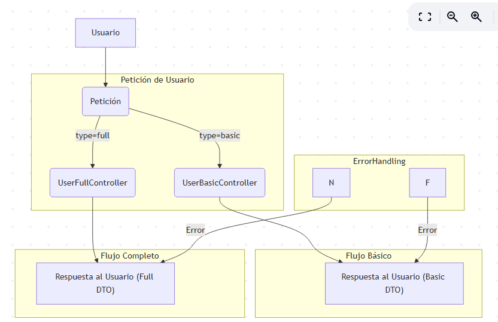
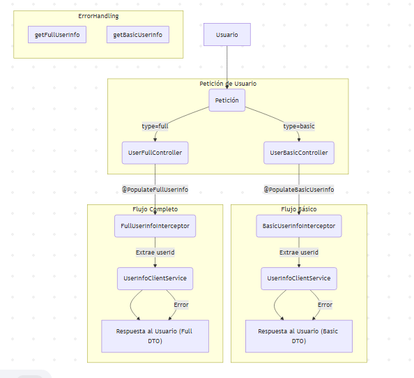
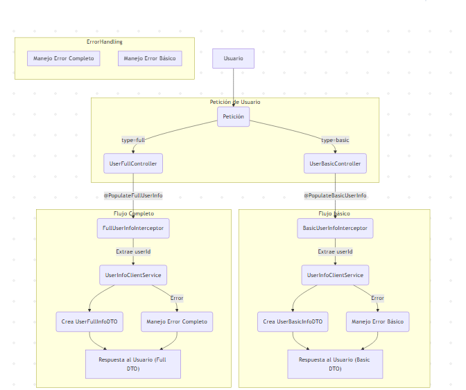
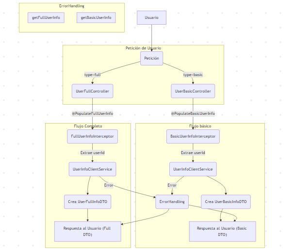
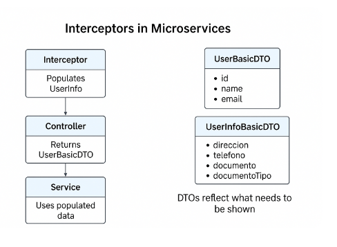
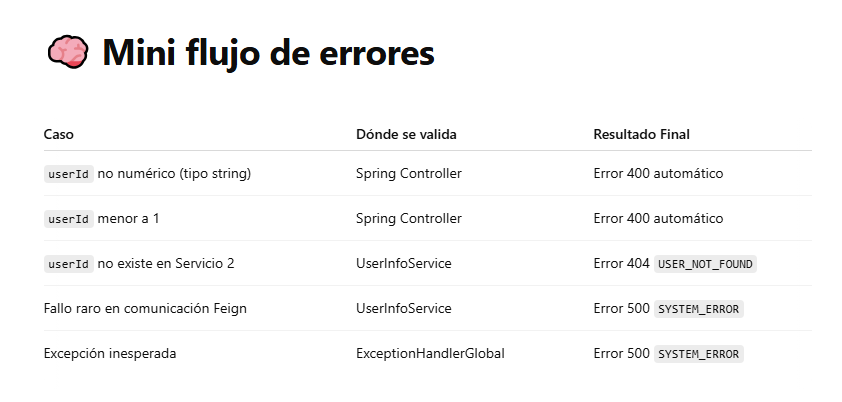
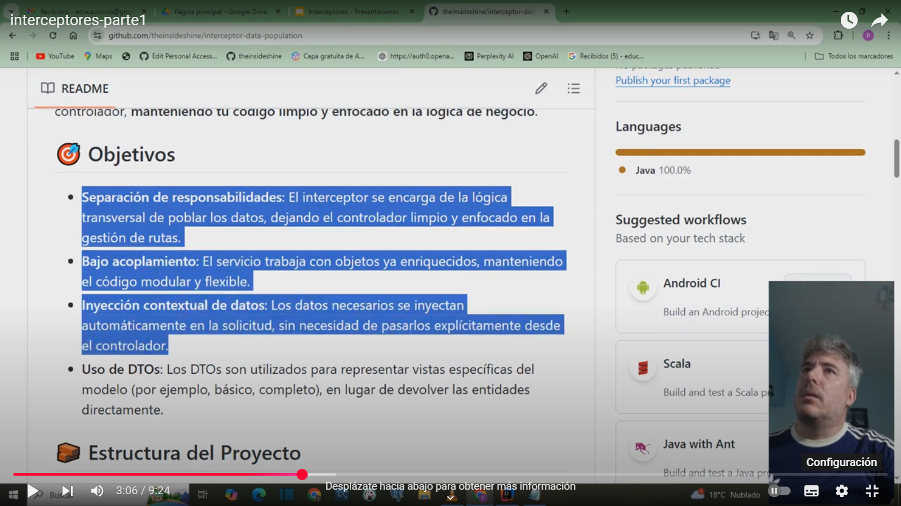
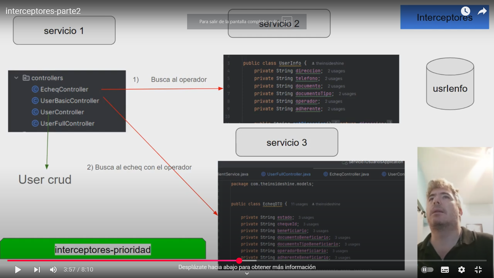
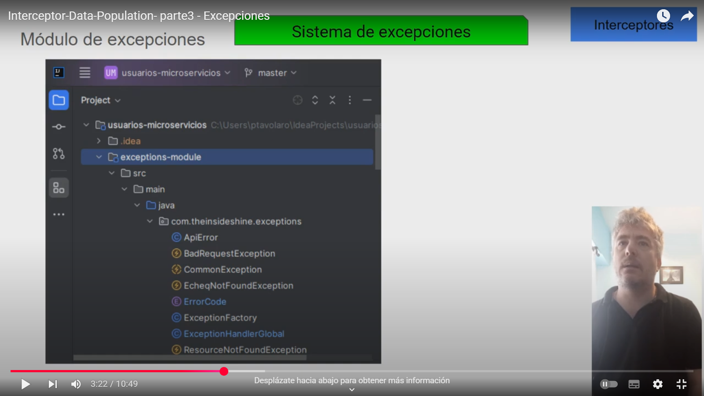

# interceptor-data-population

This project demonstrates the use of interceptors to automatically populate data in services, separating the responsibilities of data enrichment from the controller. It is designed as a didactic example to understand how to inject contextual information into a request without manually passing it from the controller, **keeping your code clean and focused on business logic**.

## 🎯 Objectives

- **Separation of Concerns**: The interceptor handles the cross-cutting logic of populating data, leaving the controller clean and focused on route management.
- **Low Coupling**: The service works with already enriched objects, keeping the code modular and flexible.
- **Contextual Data Injection**: Necessary data is automatically injected into the request, without the need to explicitly pass it from the controller.
- **Use of DTOs**: DTOs are used to represent specific views of the model (e.g., basic, full), instead of returning entities directly.

## 🧱 Project Structure

- **Interceptors**: Responsible for intercepting requests and populating the necessary data by calling the corresponding services.
- **Controllers**: Handle requests but do not worry about populating data, delegating that task to the interceptors.
- **Services**: Receive already enriched data and focus solely on business logic.
- **DTOs**: Represent the necessary views of the model, facilitating the creation of different levels of detail (e.g., basic, full).

## 💡 Key Concepts

- **Interceptor**: A component that allows executing cross-cutting logic (such as populating data) before the request reaches the controller.
- **DTO (Data Transfer Object)**: An object used to transmit data between processes, representing only what is necessary for each view (e.g., only basic or full fields).

---

## ✅ What Your Design Shows

- **Clear Separation of Concerns**:
    - The interceptor handles the cross-cutting logic: populating data.
    - The controller knows nothing about the "enriching" process of the user.
    - The service works with already enriched objects: low coupling.

- **Demonstration of how contextual information is injected into the request without the need to manually pass it from the controller.** Imagine automatically injecting authenticated user information or configuration details based on the request.

- **DTOs reflect what needs to be shown, not the entire model.** This is perfect for explaining:
    - Why we don't return complete entities directly to the API.
    - How to create different views of the same model (basic, full, etc.) for different needs.

---

## 🚀 How to Clone and Run the Project

1.  **Clone the repository:**
    ```bash
    git clone <REPOSITORY_URL>
    cd interceptor-data-population
    ```

2.  **Prerequisites:** Make sure you have the following installed:
    * [Specify the prerequisites here, e.g.: Java JDK (version), Maven or Gradle, Docker (if applicable), etc.]

3.  **Build the project:**
    * If you use Maven:
        ```bash
        mvn clean install
        ```
    * If you use Gradle:
        ```bash
        ./gradlew build
        ```

4.  **Run the application:** The way to run the application will depend on the framework used (Spring, Quarkus, etc.). Here are common examples:
    * **Spring Boot (with Maven):**
        ```bash
        mvn spring-boot:run
        ```
    * **Spring Boot (with Gradle):**
        ```bash
        ./gradlew bootRun
        ```
    * **Quarkus (in development mode):**
        ```bash
        ./mvnw quarkus:dev
        ```
      or
        ```bash
        ./gradlew quarkusDev
        ```
    * **Quarkus (as an executable JAR):** After building, run the JAR found in the `target` directory:
        ```bash
        java -jar target/interceptor-data-population-*.jar
        ```

    [**Note:** Adapt these commands according to your project's specific configuration.]

5.  **Access the application:** Once the application is running, you can access the test endpoints. For example: `http://localhost:8080/users/populate/basic/123`.

---

## 🧭 Interceptors and Filters: Differences Between Spring and Quarkus

In this project, we use **interceptors** to populate data before it reaches the service. This cross-cutting logic can be implemented in different ways depending on the framework. Both **Spring** and **Quarkus** (JAX-RS) offer similar tools, but with different names and approaches.

### 📌 Comparative Table

| Objective                          | Spring (Spring MVC)               | Quarkus / JAX-RS (RESTEasy)           |
|----------------------------------|-----------------------------------|----------------------------------------|
| Intercept controller logic       | `HandlerInterceptor`              | `ContainerRequestFilter`              |
| Modify raw request/response      | `javax.servlet.Filter`            | — (does not work on `HttpServlet`)     |
| Intercept data read/write (JSON/XML) | —                             | `ReaderInterceptor` / `WriterInterceptor` |
| Execution order                  | `@Order` or registration in `WebMvcConfigurer` | `@Priority`                         |

---

### 🔁 Didactic Example

Suppose we want to **automatically inject the authenticated user** so that the service receives it without the controller having to pass it:

- In **Spring**, we do this with a `HandlerInterceptor`, which takes the token from the request, looks up the user, and stores it in a context accessible by the services (for example, with `ThreadLocal` or attributes in the request).

  ```java
  public class AuthenticationInterceptor implements HandlerInterceptor {
      @Autowired
      private UserService userService;

      @Override
      public boolean preHandle(HttpServletRequest request, HttpServletResponse response, Object handler) throws Exception {
          String token = request.getHeader("Authorization");
          if (token != null && token.startsWith("Bearer ")) {
              String userId = extractUserIdFromToken(token.substring(7));
              User authenticatedUser = userService.findById(userId);
              request.setAttribute("authenticatedUser", authenticatedUser);
          }
          return true;
      }
  }

  // In the service:
  @Service
  public class MyService {
      public void processRequest(HttpServletRequest request) {
          User user = (User) request.getAttribute("authenticatedUser");
          // Business logic using the authenticated user
      }
  }

### 🔁 Diagramas













### 🎥 Videos

[](https://youtu.be/WYAT77In77E)

[](https://youtu.be/81qGdPhvqX4)

[](https://www.youtube.com/watch?v=RIHSZSK_Zqw)


